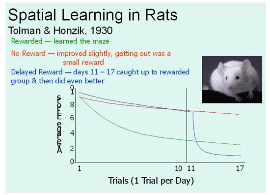

# Intro To CogSci

Lecture - 2 
4th Aug 2023

## A brief history of Cognitive Science

* The roots date back far in history but the real genesis of the interdisciplinary cog sci field lies in the 1950s
* Symposium of Information Theory (MIT) - Sept. 1966
* Alan Newell, Herbert Simon(Computer Scientist), Noam Chomsky(Linguist), George Miller (psychologist) presented work that each took a cognitive turn
* Miller (1979) wrote about how he left the sysmposium with a conviction about how **experimental psychology, linguistics, computer science can be used to simulate mental processes**

## Developments in Psychology

* A huge influence of ***behavirorism*** early on in psychology: B. F. Skinner even opposed positing **internal processes** and focused on only what was observable: **behavior changes with stimulus (and reinforcement/reward structure) changes** 
* However, some people though differently, Tolman for example even posited that rats navigate through mazes by forming cognitive maps.
* Behaviorim and S-R (Stimulus-Response) -> Cognitivism and S-O-R models N computational view of the mind N connectionism N dynamical systems approaches.
* (Mind is there to help you compute)
  
## Behaviorism

* [Puzzle Box - Thorndike and the Law of Effect](https://www.youtube.com/watch?v=fanm--WyQJo)
* No "Aha" moment. Trial and error learning.
* Behavior changes -- TBC

## Cognitive Models of Learning

* BehaviorismL S-R models 
* Skinner... TBC

## S-O-R Models

* S-O-R 

## Latent Learning
* Rats that weren't reinforced developed spatial representations of the maze anyway.
* **Cognitive maps** are a challenge to radical behaviorism

## Latent Learning in a Maze

## Cognitivism -> The computer model of the mind

* The mind is like a computer
* Information Processing ... TBC

## What is the computer model?

* The mind is an information processing system
* Information processing is best explained by computations and symbols.
  * Information processing in the computer = programs operating on symbols
  * Information processing in the brain = Symbol processing system

IMP: Debate topic possible -> Symbol/Mental representation 

## Mental representations
* Mental represntations are symbols in the brain that have meaning or encode information.
* Thinking P ~ Activating a mental representation that mean P.

## Information processing in the mind

* Perception
  * Acquiring real-time information about the surround environment
* Language use
  * making use of information about syntax, semantics and phonology
* Reasoning
  * combining different sources of informatino, deriving new information, testing consistency of information, etc.
* Action
  * making use of information in action planning and guidance

## How would you even study this complex system (Referring to human brain here)?

**Marr (1982)**
"Trying to understand perception by studying only neurons is like trying to understand bird flight by studying only feathers; it cannot be done"

"The nature of the computation that underlie perception depends more upon the computational problems that have to be solved than upon the particular hardware which their solutions are implemented"

IMP: Read original paper (Uploaded on moodle)

## Three Levels of Description
* A complete understanding of a computational ysstem has to involve 3 levels:
  1. Computation: What is the input? What is the output? What is the information that needs to be extracted and in order to solve what problem? is the Output readily inferref or extracted from the input? (usually no) - what additional assumptions must one make to make the problem tractable?
  2. Algorithm/representation (software): which computational procedures are used
  3. Implementation (hardware): How the computations are implemented

* Many problems in cognitive science are **ill-posed**
* We have to bring in these additional assumptions to make these problems tractable
* Eg. To solve the color constancy problem (i.e how to) ... TBC

## Example: word learning

* When a person looks at a Rabbit and shouts "Gavanai" - What does it mean?
* Philosopher Quine:
  * Ears?
  * Fur?
  * Eyes?
  * Rabbit?
  * Detached Rabbit Parts?
  * Animal?
* IT IS TYPICALLY AMBIGUOUS WHAT THE REFERRENT EXACTLY MEANS WITHOUT THE COMPLETE INFORMATION
* Child Language Acquisition

## Algorithm/representation
* How does the system do what it does?
  * Can we write the "code" to do this task?
  * What assumptions, computations, and representations
  * How would we find out?
  * In color vision .. TBC

## Hardware
* How is the computation physically realized...TBC

## Summary

1. Computation: Specifies the problem
2. Algorithm: Specifies the way the problem is solved
3. Hardware: ...TBC

## Interesting Links

1. https://www.simplypsychology.org/tolman.html
2. https://www.allthescience.org/what-is-color-constancy.htm
3. https://nancysbraintalks.mit.edu/video/12-how-can-we-study-human-mind-and-brain-marr%E2%80%99s-level%E2%80%99s-analysis